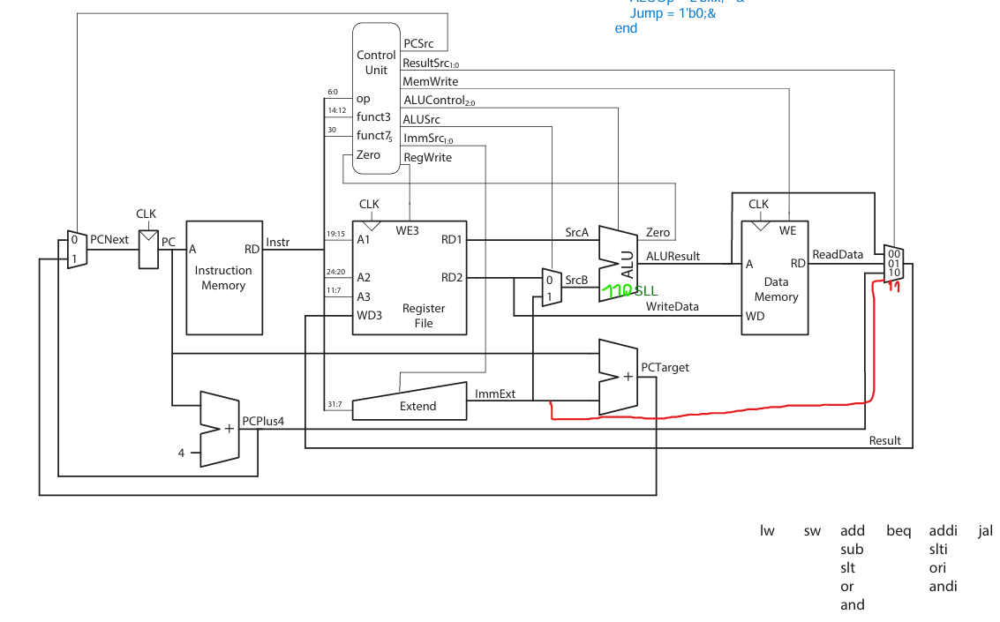

# RISC-V 32-bit Single-Cycle Processor Design

This repository contains a Register Transfer Level (RTL) implementation of a **32-bit Single-Cycle RISC-V Processor** based on the RV32I base integer instruction set architecture.

The design is implemented in **Verilog**, verified with a self-checking testbench, and demonstrated using a custom **Assembly algorithm (Population Count)** that calculates the Hamming weight of 32-bit integers.

## 🚀 Project Overview

-   **Architecture:** 32-bit RISC-V Single-Cycle (Harvard Architecture).
-   **HDL:** Verilog HDL.
-   **Verification:** Icarus Verilog (Simulation) & GTKWave (Waveform Analysis).
-   **Application:** Custom Assembly implementation of the "Population Count" algorithm.

## 🛠️ Supported Instruction Set

The processor implements a subset of the RV32I ISA, supporting the following instructions:

| Type       | Instructions                            | Description                          |
| :--------- | :-------------------------------------- | :----------------------------------- |
| **R-Type** | `ADD`, `SUB`, `AND`, `OR`, `SLT`, `SLL` | Arithmetic, Logic, Shift operations. |
| **I-Type** | `LW`, `ADDI`, `SLTI`, `ORI`, `ANDI`     | Load Word, Immediate operations.     |
| **S-Type** | `SW`                                    | Store Word.                          |
| **B-Type** | `BEQ`                                   | Branch Equal.                        |
| **U-Type** | `LUI`                                   | Load Upper Immediate.                |
| **J-Type** | `JAL`                                   | Jump and Link.                       |

## 📂 Repository Structure

```text
.
├── rtl/                        # Register Transfer Level (Verilog source codes)
│   ├── riscvsingle.v           # Top module - Processor core
│   ├── controller.v            # Controller (maindec, aludec)
│   └── datapath.v              # Datapath (ALU, RegFile, Extend, etc.)
├── tbs/                        # Testbench and Simulation files
│   └── riscvsingle_tb.v        # Top-level testbench
├── sw/                         # Assembly source code
│   └── popcount.asm            # Population Count algorithm source
├── docs/                       # Documentation and logs
│   ├── datapath.png            # Datapath block diagram
│   └── results.txt             # Simulation results
└── README.md
```

## 📊 Software Application: Population Count

To validate the processor's logic and performance, a **Population Count (Popcount)** algorithm was written in RISC-V Assembly.

-   **Logic:** The program iterates through an array of 20 integers.
-   **Operation:** For each integer, it counts the number of set bits (1s) using bitwise shifts and masking.
-   **Output:** The result is stored in a separate memory array and compared against expected values in the testbench.

### Simulation Results

The design was simulated using `iverilog`. Below is the execution log verifying the correct output for specific test vectors:

```text
========== SIMULATION RESULTS ==========
Total Cycle Count: 4174

Index | ARRAY      | Expected | Calculated | Cycles | Status
------|------------|----------|------------|--------|------
    0 | 0x00000000 |        0 |          0 |    201 | PASS
    1 | 0x00000001 |        1 |          1 |    206 | PASS
    2 | 0x00000200 |        1 |          1 |    206 | PASS
    3 | 0x00400000 |        1 |          1 |    206 | PASS
    4 | 0x80000000 |        1 |          1 |    206 | PASS
    5 | 0x51c06460 |       10 |         10 |    215 | PASS
    6 | 0xdec287d9 |       18 |         18 |    223 | PASS
    7 | 0x6c896594 |       14 |         14 |    219 | PASS
    8 | 0x99999999 |       16 |         16 |    221 | PASS
    9 | 0xffffffff |       32 |         32 |    237 | PASS
   10 | 0x7fffffff |       31 |         31 |    236 | PASS
   11 | 0xfffffffe |       31 |         31 |    236 | PASS
   12 | 0xc7b52169 |       16 |         16 |    221 | PASS
   13 | 0x8ceff731 |       20 |         20 |    225 | PASS
   14 | 0xa550921e |       13 |         13 |    218 | PASS
   15 | 0x0db01f33 |       15 |         15 |    220 | PASS
   16 | 0x24bb7b48 |       16 |         16 |    221 | PASS
   17 | 0x98513914 |       12 |         12 |    217 | PASS
   18 | 0xcd76ed30 |       18 |         18 |    223 | PASS
   19 | 0xc0000003 |        4 |          4 |    209 | PASS

========== SPECIAL CASES ==========
0xFFFFFFFF (index 9) :  237 cycles
0x80000000 (index 4) :  206 cycles
0xC7B52169 (index 12):  221 cycles
```

## 💻 Datapath Diagram

The processor architecture follows the standard Single-Cycle RISC-V implementation involving Instruction Memory, Register File, ALU, and Data Memory.



## 🔧 How to Run

### Prerequisites

-   **Icarus Verilog** (for compilation and simulation)
-   **GTKWave** (for waveform viewing)

### Simulation Steps

1.  **Clone the repository:**

    ```bash
    git clone https://github.com/sergenyalc1n/RISCV_32-bit_Single_Cycle_Processor.git
    cd RISCV-Single_cycle_processor
    ```

2.  **Compile the design:**

    ```bash
    cd tbs
    iverilog -o riscvsingle_tb.vvp riscvsingle_tb.v
    ```

3.  **Run the simulation:**

    ```bash
    vvp riscvsingle_tb.vvp
    ```

    _This will execute the population count algorithm and display the pass/fail status in the terminal._

4.  **View waveforms (Optional):**
    ```bash
    gtkwave riscvsingle_tb.vcd
    ```

---

_Developed as a Computer Organization coursework project._

```

```
